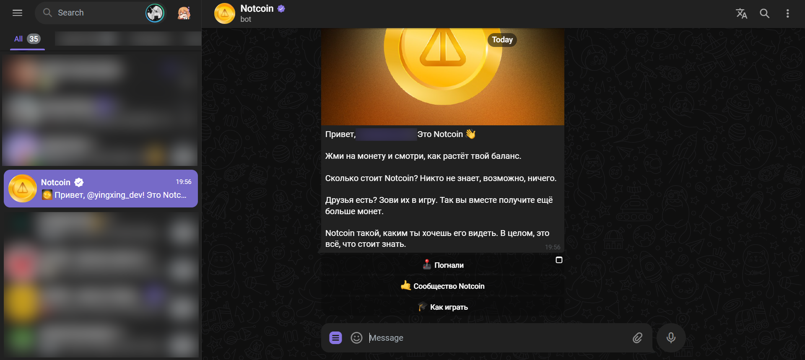

Автор данного проекта: https://t.me/alexnotcoin

Я использовал некоторую часть кода, чтобы написать свою версию, где переработана суть работы и симуляция кликов (хотите поставить звезду? Не забудьте поставить её и автору оригинальной версии в первую очередь, большое спасибо!)

## ИГРАЕМ ЗА СКВАД БРАТИШКИНА:
https://t.me/notcoin_bot?start=rp_2842162

## Запуск Notcoin с компьютера (браузерная версия)
1. Авторизуйтесь с компьютера в [Telegram Web](https://web.telegram.org).
2. После авторизации перейдите в бота [Notcoin Bot](https://t.me/notcoin_bot?start=rp_2842162).
3. Запустите бота

## Получение ссылки на запуск кликера
1. Нажмите клавишу F12 (или нажмите правую кнопку мыши и выберите "Посмотреть код"), затем перейдите на вкладку "Network" (или "Сеть"). 
2. Нажмите кнопку, отвечающую за вход в приложение.
3. Найдите событие "event", как показано на изображении.

4. Из интересующего нас события скопируйте параметр "u" (ссылка будет иметь примерно следующий вид):
   ```
   https://clicker.joincommunity.xyz/clicker#tgWebAppData=query_id%*D**GO*-**AA**AI***gwalO3m%26user%3D%257B%2522id%2522%253A2****0478%252C%2522first_name%2522%253A%2522*******%2522%252C%2522last_name%2522%253A%2522*******%2522%252C%2522username%2522%253A%2522******%2522%252C%2522language_code%2522%253A%2522ru%2522%252C%2522is_premium%2522%253Atrue%252C%2522allows_write_to_pm%2522%253Atrue%257D%26auth_date%3D170**16279%26hash%3D7dfa***db35***b593aa80f3***9858ca0649c5***cd001bf888888b770a3ff0e&tgWebAppVersion=7.0&tgWebAppPlatform=web&tgWebAppThemeParams=%7B%22bg_color%22%3A%22%23ffffff%22%2C%22button_color%22%3A%22%233390ec%22%2C%22button_text_color%22%3A%22%23ffffff%22%2C%22hint_color%22%3A%22%23707579%22%2C%22link_color%22%3A%22%2300488f%22%2C%22secondary_bg_color%22%3A%22%23f4f4f5%22%2C%22text_color%22%3A%22%23000000%22%2C%22header_bg_color%22%3A%22%23ffffff%22%2C%22accent_text_color%22%3A%22%233390ec%22%2C%22section_bg_color%22%3A%22%23ffffff%22%2C%22section_header_text_color%22%3A%22%233390ec%22%2C%22subtitle_text_color%22%3A%22%23707579%22%2C%22destructive_text_color%22%3A%22%23df3f40%22%7D
   ```
8. В скопированной ссылке замените параметр "tgWebAppPlatform=web" (иногда "tgWebAppPlatform=weba") на "tgWebAppPlatform=ios".
Измененную ссылку отправляем в браузер.
9. Откройте измененную ссылку в браузере.


### ВАЖНО
C 07.01 сессия с браузера держится не более 3ех часов.
Для того, чтобы все работало, необходимо в пункте "Получение ссылки на запуск кликера" проделать все действия сначала, не забыв перезагрузить вкладку с Telegram.

## Скрипт для автоматизации нажатий

Данный скрипт позволяет автоматически собирать ракеты, появляющиеся в игре, а также автоматически тапать до момента, пока энергия не закончится. Ниже приведены параметры, которые можно редактировать для настройки скрипта:

- `powerLimitForAutotap`: параметр, отвечающий за определение целевого баланса. Скрипт будет автоматически тапать для достижения этого баланса.
`В отличие от оригинального скрипта энергия будет растрачиваться до 0 при достижении выставленного лимита`

- `clickPeriod_ms`: параметр, определяющий период нажатий в миллисекундах (минимум 150-200)
- `useDoubleClick`: параметр, определяющий использования двойного клика (для второго клика точки нажатия подбираются индивидуально, по умолчанию включён)

### Как запустить

1. Нажмите клавишу F12 (или откройте Исходный код страницы),
2. Вставляем скрипт ниже (если вставка в браузере запрещена, то https://stackoverflow.com/questions/77587864/disable-paste-protection-in-chrome-devtools)

Сам скрипт:
```javascript
// user values : you can edit this
powerLimitForAutotap = 1000
clickPeriod_ms = 150
useDoubleClick = true

// coin parameters : do not touch
notecoin = null
notecoin_x1 = 0;
notecoin_y1 = 0;
notecoin_x2 = 0;
notecoin_y2 = 0;

// power parameters : do not touch
power_recharging = true
current_power = 0

// click parameters : do not touch
next_click_points = {
    "x": 0,
    "y": 0,
    "id": 0
}
next_second_click_points = {
    "x": 0,
    "y": 0,
    "id": 0
}
next_click_delay = clickPeriod_ms
last_click_at = 0

// boost parameters : do not touch
boost_mode = false;
awaiting_finished = false;
awaiting_boost = false;
awaiting_from = 0;
awaiting_time = 0;

function simulateTouchEvent(element, type, touches) {
  const touchEvents = [];

  touches.forEach((touch) => {
    touchEvents.push(new Touch({
      clientX: touch.x,
      clientY: touch.y,
      identifier: touch.id,
      target: element,
    }));
  });

  element.dispatchEvent(new TouchEvent(type, {
    touches: touchEvents,
    view: window,
    cancelable: true,
    bubbles: true,
  }));
}

function getRandomArbitrary(min, max) {
  return Math.random() * (max - min) + min;
}

function updateNextClickDelay() {
    last_click_at = Date.now()
    next_click_delay = clickPeriod_ms + getRandomArbitrary(0, 75)
}

function updateCoinAndPositions() {
    try {
        notecoin = document.querySelectorAll('div[class^="_notcoin"]')[0]
        
        // update coin boundary data
        let coinBound = notecoin.getBoundingClientRect()
        let padding = coinBound.width / 100 * getRandomArbitrary(5, 20)
        notecoin_x1 = coinBound.left + padding
        notecoin_y1 = coinBound.top + padding
        notecoin_x2 = coinBound.right - padding
        notecoin_y2 = coinBound.bottom - padding
    
        // update next touch data
        next_click_points = {
            "x": getRandomArbitrary(notecoin_x1, notecoin_x2),
            "y": getRandomArbitrary(notecoin_y1, notecoin_y2),
            "id": 0
        }

        if (useDoubleClick) {
            next_second_click_points = {
                "x": getRandomArbitrary(notecoin_x1, notecoin_x2),
                "y": getRandomArbitrary(notecoin_y1, notecoin_y2),
                "id": 1
            }
        }
    } catch(error) {
        return false
    }
    return true
}

function updateCurrentPower() {
    try {
        current_power = parseInt(document.querySelector('div[class^="_scoreCurrent"]').textContent);
    } catch (error) {
        return false
    }
    return true
}

function detectBoost() {
    let imrocket = document.querySelectorAll('img[class^="_root"]');
    if (imrocket !== undefined && imrocket !== null) {
        try {
            let boost = imrocket[0][Object.keys(imrocket[0])[1]];
            return boost !== null && boost !== undefined;
        } catch (error) {}
    }
    return false
}

function updateBoostState() {
    try {
        if (!awaiting_boost) {
            if (detectBoost()) {
                awaiting_from = Date.now();
                awaiting_time = getRandomArbitrary(1250, 1950);
                awaiting_boost = true;
            }
            return false;
        } else if (!awaiting_finished) {
            if (Date.now() - awaiting_from >= awaiting_time) {
                 try {
                    let imrocket = document.querySelectorAll('img[class^="_root"]');
                    let boost = imrocket[0][Object.keys(imrocket[0])[1]];
                    if (boost !== null && boost !== undefined) {
                        boost.onClick();
                        awaiting_finished = true;
                        return awaiting_finished;
                    }
                } catch (error) {}
            }
        }
        return awaiting_finished;
    } catch (error) {
        return false;
    }
}

function isPowerForClickAvailable() {
    if (power_recharging) {
        if (current_power >= powerLimitForAutotap) {
            power_recharging = false;
        }
    } else {
        if (current_power <= 0) {
            power_recharging = true;

            // disable boost mode
            boost_mode = false;

            // clear boost cache
            awaiting_from = 0;
            awaiting_time = 0;
            awaiting_boost = false;
            awaiting_finished = false;
        }
    }
    return !power_recharging
}

function isBoostMode() {
    return boost_mode
}

function isUserNotOnClickerPage() {
    return window.location.href !== "https://clicker.joincommunity.xyz/clicker" && !window.location.href.includes('https://clicker.joincommunity.xyz/clicker#');
}

async function update() {
    if (Date.now() - last_click_at < next_click_delay || isUserNotOnClickerPage()) {
        return;
    }

    if (updateBoostState()) {
        power_recharging = false;
        boost_mode = true;
    }
    
    if (updateCurrentPower() && updateCoinAndPositions()) {
        if (!isPowerForClickAvailable() && !isBoostMode()) {
            return;
        }
        
        simulateTouchEvent(notecoin, 'touchstart', [next_click_points])
        updateNextClickDelay()
        
        setTimeout(function() {
            simulateTouchEvent(notecoin, 'touchend', [next_click_points])
        }, getRandomArbitrary(75, 120))

        if (useDoubleClick) {
            setTimeout(function() {
                simulateTouchEvent(notecoin, 'touchstart', [next_second_click_points])
                setTimeout(function() {
                    simulateTouchEvent(notecoin, 'touchend', [next_second_click_points])
                }, getRandomArbitrary(75, 120))
            }, getRandomArbitrary(30, 75));
        }
    }
}

// start updater
setInterval(update, 1);
```

Над стабильностью кода я поработал, проблем не должно быть, но каждый берёт ответственность за результат САМ
# ИСПОЛЬЗУЙТЕ НА СВОЙ СТРАХ И РИСК
